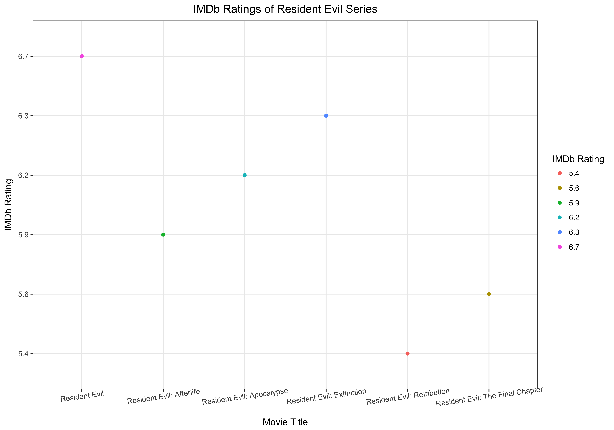
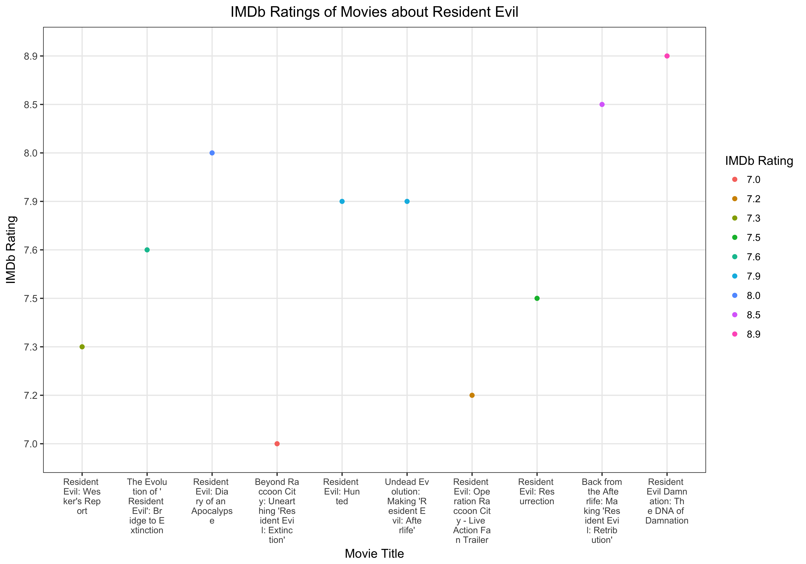

```{r}
library(httr)
library(purrr)
library(glue)
library(plyr)
library(ggplot2)
library(reshape)
library(tidyverse)
```
## Make API queries “by hand” using`httr`.

Create a dataset with multiple records by requesting data from an API using the`httr`package.

`GET()`data from the API and convert it into a clean and tidy data frame. Store that as a file ready for (hypothetical!) downstream analysis. Do just enough basic exploration of the resulting data, possibly including some plots, that you and a reader are convinced you’ve successfully downloaded and cleaned it.

## About this project

***This project is one homework for [STAT547](http://stat545.com/index.html)***

I used [OMDb API](http://www.omdbapi.com) to get some simple information about movies. Three functions were created to simplify the process:

`Search_by_name()`: Search movie by name and page. We can only request for one page results every time and the`page`paramter was set as 1 by default.

`Get_Ratings()`: Get the ratings of movie when giving IMDb ID as the input. The ratings include: "IMDb","RottenTomatoes","Metacritic".

`Get_Ratings_By_name()`: Combine the functions above to get the ratings by giving search name and page number.

## Display data and plots

```{r}
Batman <- read_csv("./Batman_page2.csv")
Batman_ratings <- read_csv("./Batman_Rating_page2.csv")
Resident_Evil <- read_csv("./Resident_Evil.csv")
```

```{r}
knitr::kable(Batman)
knitr::kable(Batman_ratings)
knitr::kable(Resident_Evil)
```

### Plot1: IMDb Ratings of Resident Evil Series



### Plot2: IMDb Ratings of Movies about Resident Evil




